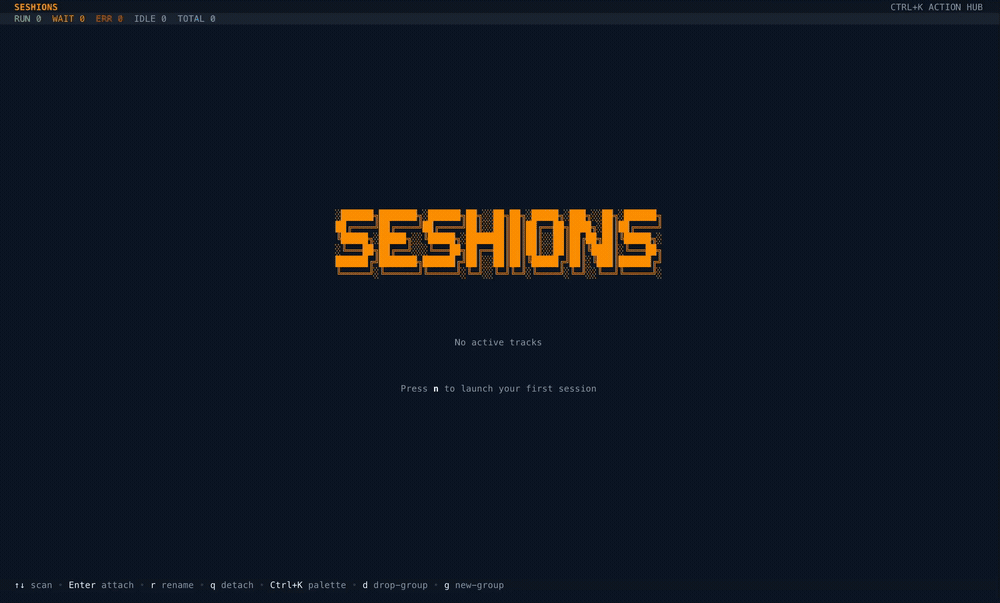

# Seshions

Terminal session orchestrator for running multiple coding agents in parallel.

## Demo



## What It Does

- Launch and track multiple AI coding sessions in one dashboard
- Launch blueprints to spin up multiple role-based sessions in one action
- Dispatch prompts to a single role or broadcast to all sessions in a group
- Attach/detach quickly with keyboard-first controls
- Group sessions by workflow
- Auto-discover Claude team members from local Claude metadata and surface them in the roster
- Optional git worktree isolation per session
- Persist session state across restarts via tmux

## Keyboard UX

- Footer is contextual: it always shows core keys (`Enter`, `r`, `q`, `/`) and adapts extra hints based on what is selected.
- `/` opens the Action Hub (command palette) for advanced actions.
- Action Hub includes orchestration commands: `Global inbox`, `Dispatch to role`, and `Broadcast to group`.
- Press `i` to open Global Inbox (waiting approvals, errors, and active sessions in one place).
- Press `v` to hide/show Claude metadata-only rows (`no-pane`) in the roster.
- Pressing `d` opens a confirmation dialog before deleting a session or group.
- Press `b` to open Launch Blueprints.

## Updates

- `seshions` checks npm once per day for a newer version.
- If outdated, startup is blocked until updated (Codex-style behavior).
- You get a startup prompt: `Install now? (yes/no)`.
- If you answer `yes`, it runs: `npm install -g seshions@latest` and exits so you can relaunch.
- If you answer `no` (or update fails), the app exits.
- Upgrade command: `npm install -g seshions@latest`
- Disable update checks only if needed with `SESHIONS_DISABLE_UPDATE_CHECK=1`

## Requirements

- Node.js 18+
- tmux
- At least one coding tool installed (`claude`, `codex`, `gemini`, `opencode`, or custom shell command)

## Install (One Command)

Run immediately (no global install):

```bash
npx seshions@latest
```

Install globally:

```bash
npm install -g seshions
seshions
```

The npm launcher downloads the matching native runtime automatically and caches it in `~/.seshions/runtime`.

## Launch Blueprints (Multi-Agent Spawn)

Create and launch a reusable multi-session template:

1. Open `seshions`
2. Press `b` (or `/` -> `Launch blueprints`)
3. Create blueprint:
   - Name
   - Group path
   - Worktree root path
   - Roles list (`planner,builder,debugger,reviewer,explorer`)
   - Tool + command template (`codex "You are the ${role} agent for this workspace. Stay in this role."`)
   - Note for Codex: `--agent` is not supported by Codex CLI
4. Select blueprint and launch all sessions at once

## Orchestration (From One Controller Session)

1. Open Action Hub with `/`
2. Open `Global inbox` (or press `i`) to triage cross-session activity quickly
3. Inbox shortcuts: `Enter` attach, `y` approve, `n` deny, `a` acknowledge, `v` view
4. Choose `Dispatch to role` to send one prompt to a single target session
5. Or choose `Broadcast to group` to send one prompt to every active session in that group
6. Composer supports multi-line prompts (`Enter` adds newline, `Ctrl+Enter` sends)
7. Broadcast requires an explicit second `Ctrl+Enter` confirmation before sending

## Claude Team Auto-Discovery

When Claude team metadata exists, `seshions` adds a `Claude Teams` section in the roster and keeps it updated automatically.

- Reads teams from `~/.claude/teams/*/config.json`
- Reads task state from `~/.claude/tasks/<team-name>/`
- Maps teammates to active Claude sessions when possible and shows link confidence (`linked`, `probable`, `no-pane`)
- Shows per-team task counters (`P`, `IP`, `C`) and teammate runtime status in the roster
- Use `v` or Action Hub command `Toggle Claude metadata rows` to hide/show metadata-only rows

Optional override for testing/custom setups:

```bash
export SESHIONS_CLAUDE_HOME=/path/to/claude-root
```

## Local Development

```bash
bun install
bun run build
bun run typecheck
bun test
```

## Run

```bash
bun run dist/index.js
```

## Build Binary

```bash
bun run compile
```

## Install Script

Alternative manual installer:

```bash
export SESHIONS_REPO="danhergir/seshions"
curl -fsSL "https://raw.githubusercontent.com/${SESHIONS_REPO}/main/install.sh" | bash
```

## Uninstall

If installed with npm:

```bash
npm uninstall -g seshions
```

Remove cached runtime + state data:

```bash
rm -rf ~/.seshions
```

If installed with the manual installer:

```bash
export SESHIONS_REPO="danhergir/seshions"
curl -fsSL "https://raw.githubusercontent.com/${SESHIONS_REPO}/main/uninstall.sh" | bash
```

Optional full cleanup (manual installer):

```bash
curl -fsSL "https://raw.githubusercontent.com/${SESHIONS_REPO}/main/uninstall.sh" | bash -s -- --purge-data
```
